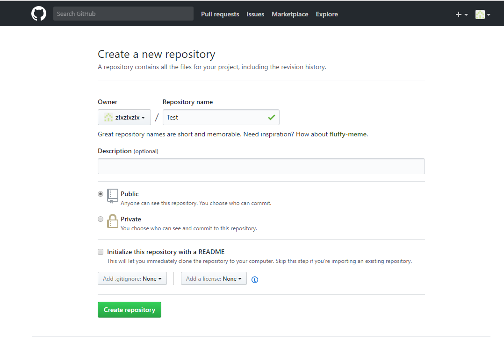
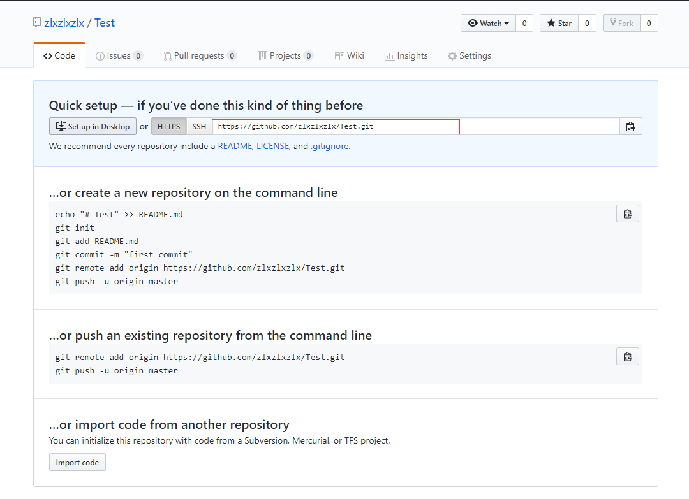

# 1101.关联项目
1. git初始化
```
git init
```
2. 设置remote地址
```
git remote add 地址
```
3. 查看已经链接的地址
```
git remote -v
```
4. 将全部文件加入git版本管理 .的意思是将当前文件夹下的全部文件放到版本管理中
```
git add .
```
5. 提交文件 使用-m 编写注释
```
git commit -m "注释"
```
6. 推送到远程分支
```
git push
```
7. 查看当前全部的配置
```
git config -l
```
8. 全局级配置，如果没有仓库级别的特殊配置，默认读取这个配置
```
git config --global user.name "name"
git config --global user.email "email"
```
9. 仓库级配置，一般一个项目配置一次

```
git config user.name "name"
git config user.email "email"
```
---
4.上传  

上传本地代码及更新代码到GitHub教程
上传本地代码  

第一步：去github上创建自己的Repository，创建页面如下图所示：

红框为新建的仓库的https地址

第二步：
```
echo "# Test" >> README.md
```
第三步：建立git仓库
```
git init
```
第四步：将项目的所有文件添加到仓库中
```
git add .
```
第五步：
```
git add README.md
```
第六步：提交到仓库
```
git commit -m "注释语句"
```
第七步：将本地的仓库关联到GitHub，后面的https改成刚刚自己的地址，上面的红框处
```
git remote add origin https://github.com/zlxzlxzlx/Test.git
```
第八步：上传github之前pull一下
```
git pull origin master
```
第九步：上传代码到GitHub远程仓库
```
git push -u origin master
```
中间可能会让你输入Username和Password，你只要输入github的账号和密码就行了。执行完后，如果没有异常，等待执行完就上传成功了。
更新代码
第一步：查看当前的git仓库状态，可以使用git status
```
git status
```
第二步：更新全部
```
git add *
```
第三步：接着输入git commit -m "更新说明"
```
git commit -m "更新说明"
```
第四步：先git pull,拉取当前分支最新代码
```
git pull
```
第五步：push到远程master分支上
```
git push origin master
```
不出意外，打开GitHub已经同步了
